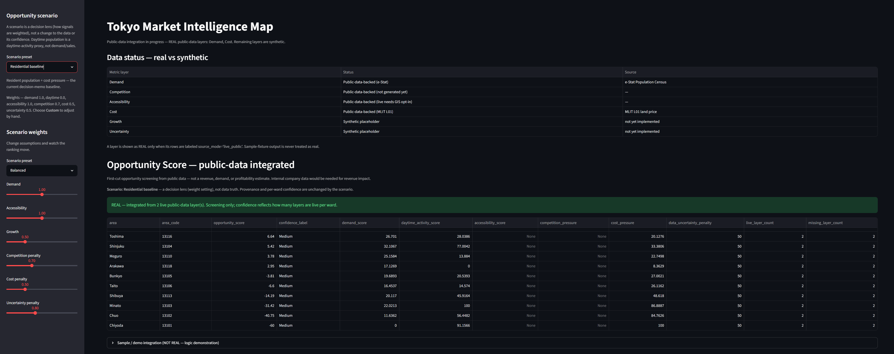
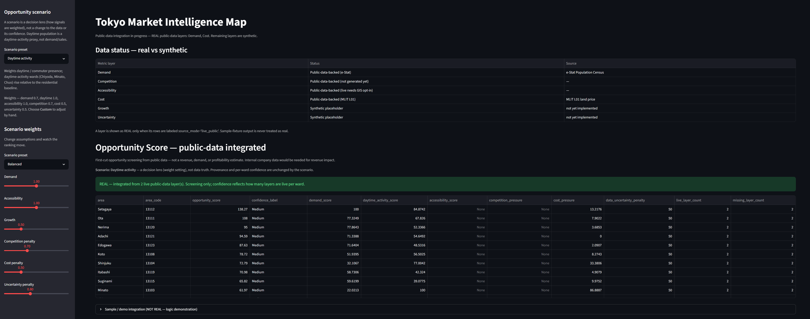
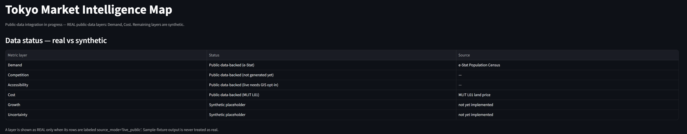
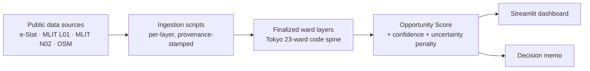

# Tokyo Market Intelligence Map

A portfolio-grade BI / Market Intelligence project that uses only public and free data to identify commercial opportunity areas in Tokyo.

## One-line concept

**Where should a consumer business prioritize expansion, marketing, or micro-fulfillment investment in Tokyo?**

For non-specialists:

> Which neighborhoods in Tokyo are easiest to do business in?

For senior BI / Intelligence reviewers:

> A reproducible decision-intelligence system that combines public geospatial, demographic, commercial, and data-quality signals into scenario-sensitive opportunity rankings.

---

## Executive summary (30-second read)

A **public-data BI / Market Intelligence product** that screens Tokyo's 23 wards for
commercial opportunity from official data only.

- **Current live result:** **Setagaya, Nerima, and Ota** are the top screening candidates
  (large resident base + lower land-cost pressure); the central high-cost wards
  (**Chiyoda, Chuo, Minato**) rank low for *residential* demand screening.
- **Resident vs daytime:** a live **daytime-activity layer** (昼間人口) makes the
  resident-vs-commuter tension tunable — raising its weight lifts central business wards
  (e.g. Chiyoda 23→17, Minato 21→11). Default weight 0, so the baseline above is unchanged.
- **Scenario presets** (decision lenses, not data truth): *Residential baseline* (default),
  *Daytime activity*, *Cost-sensitive*, and *Custom* — pick one in the dashboard sidebar to
  run the sensitivity analysis; provenance and confidence are unchanged by the choice.
- **Confidence: Medium** — **Demand** (e-Stat resident) and **Cost** (MLIT L01) are live
  (2 of 4 coverage layers); daytime activity is also live (Demand-axis refinement);
  Accessibility and Competition are not live yet.
- **What it is / isn't:** a first-cut, relative *opportunity screening* to shortlist wards —
  **not** a revenue, actual-demand, or profitability forecast, and not a final site decision.

→ Read the [decision memo](docs/decision_memo_tokyo.md) ·
reproduce the results via the [live data runbook](docs/live_data_runbook.md).

---

## How to evaluate this project

**What it is:** a reproducible **public-data Market Intelligence workflow** — a skill that
**could be embedded into a broader strategy AI or decision-support workflow**.

**What it is not:** a production site-selection system, a revenue-forecasting model, or a
final-decision tool. It is first-cut *screening*, not a forecast.

Best evaluated on the **thinking and the engineering**, not on a single ranking:

- turning an ambiguous business question into measurable public-data signals;
- provenance discipline — live vs. sample vs. pending kept explicit, never blurred;
- confidence and uncertainty made visible per ward;
- scenario presets as decision lenses (sensitivity analysis, not data truth);
- limitations stated *before* recommendations;
- a decision-memo output a stakeholder can act on.

More detail: [portfolio positioning](docs/portfolio_positioning.md).

---

## Screenshots

The dashboard makes **first-cut public-data screening** explicit — scenario presets, REAL vs
synthetic separation, and per-ward confidence. (Screening only — **not** a revenue,
actual-demand, or profitability forecast, and not a final site decision.)

**Opportunity Score — Residential baseline scenario**



The REAL integrated ranking at **Medium confidence** (2 of 4 coverage layers live). Residential
baseline is a first-cut public-data screening lens (resident demand vs. cost pressure).

**Opportunity Score — Daytime activity scenario**



The same data under the Daytime activity preset — resident-vs-daytime sensitivity, surfacing
central business wards. A scenario preset is a **decision lens**; it does not change the data
provenance or the per-ward confidence.

**Data status — real vs synthetic**



Live vs pending layer status: **Demand** and **Cost** are live (and the Daytime activity
refinement is live too); **Competition** and **Accessibility** are *intentionally pending*
(see the release checklist). A layer counts as REAL only when its rows are `live_public`.

---

## Reviewer path (suggested reading order)

For a senior BI / Intelligence reviewer, in order of "so what?" → "how":

1. **[Executive summary](#executive-summary-30-second-read)** — the result and confidence in 30 seconds (above).
2. **[Decision memo](docs/decision_memo_tokyo.md)** — the live-backed recommendation, evidence, and limitations.
3. **[Live data runbook](docs/live_data_runbook.md)** — exact, reproducible steps + observed results for each live layer.
4. **[Metric design](docs/metric_design.md)** — how each score and the Opportunity formula are defined.
5. **Dashboard / app** (`app/streamlit_app.py`) — the interactive view with real-vs-synthetic separation and scenario weights.

Supporting docs: [data sources](docs/data_sources.md) · [implementation plan](docs/implementation_plan.md) · [portfolio positioning](docs/portfolio_positioning.md) · [release checklist](docs/release_checklist.md) · [future roadmap](docs/future_roadmap.md).

## Architecture



**Layer status (4 coverage signals + 1 Demand-axis refinement):**

| Layer | Direction | Status |
|---|---|---|
| **Demand** (e-Stat resident population) | positive | **live verified** |
| **Daytime activity** (e-Stat 昼間人口) | positive (Demand-axis, weight 0 default) | **live verified** (refinement, not a coverage layer) |
| **Cost** (MLIT L01 land price) | pressure (negative) | **live verified** |
| **Competition** (OSM `shop=convenience`) | pressure (negative) | sample pipeline ready; **OSM live pending** (public Overpass endpoint returned 429/504 — backlog, retry off-peak) |
| **Accessibility** (MLIT N02 stations) | positive | sample pipeline ready; **live deferred** (needs a GIS point-in-polygon step) |

The integrated **Opportunity Score** is a **REAL ranking at Medium confidence** today (2 of 4
layers live: Demand + Cost). Competition and Accessibility are neutral-filled and reflected in
the uncertainty penalty until live — a uniform offset, so the order is unchanged while the
absolute score is flagged as provisional.

---

## Current status

This repo is moving from a synthetic MVP to public-data-backed layers. It now contains:

- Streamlit dashboard with **explicit real-vs-synthetic separation**
- scenario-weighted scoring logic + confidence labels
- **first public-data integration: e-Stat Demand layer** (ingestion client, transform, tests)
- unit tests for scoring and for the e-Stat transform
- source inventory + metric design docs
- Claude Code / Codex agent instructions
- CI workflow (ruff + pytest)

### Current data status

| Metric layer | Status | Source |
|---|---|---|
| **Demand** | **Public-data-backed (live verified)** | e-Stat Population Census (resident population, ward grain) |
| **Daytime activity** | **Public-data-backed (live verified)** | e-Stat 2020 Census 従業地・通学地集計 (昼間人口, ward grain) — Demand-axis refinement |
| **Cost** | **Public-data-backed (live verified)** | MLIT L01 地価公示 land price (ward grain) |
| **Competition** | **Sample pipeline ready; OSM live pending (Overpass 429/504)** | OSM `shop=convenience` via Overpass (ward grain) |
| **Accessibility** | **Sample pipeline ready; live deferred (GIS)** | MLIT N02 railway stations (ward grain) |
| Growth | Synthetic placeholder | not yet implemented |
| Uncertainty | Synthetic placeholder | not yet implemented |

**Live status (June 2026):** Demand (e-Stat) and Cost (MLIT L01) are **live-verified**, so
the integrated **Opportunity Score is available as a REAL ranking with Medium confidence**
(2 of 4 layers live), and the [decision memo](docs/decision_memo_tokyo.md) is built on it.
Competition (OSM) live is **pending** — an observed public Overpass endpoint reliability /
availability issue (429/504 on a small-test-then-full run); the sample transform and a 1-ward
smoke test passed, but the full live run remains pending (backlog, retry off-peak).
Accessibility (MLIT N02) live is **deferred** behind a GIS step. Both are neutral-filled +
flagged in the uncertainty penalty until live. Exact reproduction steps and observed results
are in [`docs/live_data_runbook.md`](docs/live_data_runbook.md).

Important: a layer counts as real **only when generated in live mode** (rows labeled
`source_mode == "live_public"`). Every other layer is synthetic/sample and must not be
presented as a real Tokyo finding.

- **Demand** — demographic demand proxy only (not income, purchasing power, or actual
  demand). **Live verified** against e-Stat.
- **Competition** — commercial-density / competition-pressure proxy only (not demand, sales,
  revenue, or competitor performance). ODbL: outputs carry **© OpenStreetMap contributors**.
  Live ingestion is implemented and a 1-ward smoke test succeeded, but the full live run is
  **pending** — the public Overpass endpoint returned 429 then 504, so it is a backlog item
  to retry off-peak (not live-verified).
- **Accessibility** — station-access proxy only (not demand or willingness to buy).
  Sample pipeline + tests are complete; **live N02 ingestion needs a deferred GIS step**
  (point-in-polygon vs. ward boundaries) — opt into `.[geo]` in a follow-up. Attribution:
  出典：国土数値情報（鉄道データ N02）（国土交通省）.
- **Cost** — cost-pressure proxy from published land price (円/m²) only — **not store
  rent, operating cost, or profit margin**. Higher land price → higher cost pressure (a
  negative factor in opportunity). Live is **GIS-free** (L01 carries the municipality
  code, so wards aggregate by code) — pass a downloaded L01 GeoJSON. Attribution:
  出典：国土数値情報（地価公示データ L01）（国土交通省）.

### Generate the Demand layer (e-Stat)

```bash
# Sample mode (no credentials): schema fixture only — NOT a real finding.
# Writes a SEPARATE file: data/processed/estat_demand_tokyo23_sample.csv
# (source_mode=sample_fixture). The dashboard never shows this as real.
python scripts/ingest_estat_population.py --cat-filter @cat01=000

# Live mode (real data): requires a free e-Stat application ID.
# Writes the live file: data/processed/estat_demand_tokyo23.csv
# (source_mode=live_public), scoped to the 23 ward codes.
cp .env.example .env   # then fill in ESTAT_APP_ID and ESTAT_STATS_DATA_ID
# export the vars (never commit .env), then:
python scripts/ingest_estat_population.py --mode live --cat-filter @cat01=000
```

### Generate the Daytime activity layer (e-Stat 昼間人口)

```bash
# Sample mode (no credentials): schema fixture → a SEPARATE *_sample.csv
# (source_mode=sample_fixture). The dashboard never shows this as real.
python scripts/ingest_estat_daytime.py

# Live mode: needs ESTAT_APP_ID + the daytime table id pinned in ESTAT_DAYTIME_STATS_DATA_ID
# (do not display/commit the statsDataId). Live defaults to the daytime cell cat01=180
# (昼間人口 total), so --cat-filter is optional.
python scripts/ingest_estat_daytime.py --mode live
# Writes data/processed/estat_daytime_tokyo23.csv (source_mode=live_public).
# Daytime population is a daytime-activity proxy — not demand, sales, or revenue.
# It enters the Opportunity Score as a positive Demand-axis term, default weight 0.
```

### Generate the Competition layer (OSM/Overpass)

```bash
# Sample mode (default, no network): schema fixture → a SEPARATE *_sample.csv
# (source_mode=sample_fixture). The dashboard never shows this as real.
python scripts/ingest_osm_competition.py

# Live mode: queries Overpass per ward (serial, throttled), shop=convenience.
# Be gentle — use --max-wards for a small smoke test. Writes the live file
# data/processed/osm_competition_tokyo23.csv (source_mode=live_public).
python scripts/ingest_osm_competition.py --mode live --max-wards 1
# OSM data is ODbL: outputs carry "© OpenStreetMap contributors".
```

### Generate the Accessibility layer (MLIT N02)

```bash
# Sample mode (default, no network/GIS): N02-shaped fixture → a SEPARATE *_sample.csv
# (source_mode=sample_fixture). The dashboard never shows this as real.
python scripts/ingest_mlit_accessibility.py

# Live mode: N02 stations carry no municipality code, so assigning them to wards needs
# a spatial join (GeoPandas). That GIS step is intentionally deferred — `--mode live`
# stops with a clear opt-in proposal (exit 3) rather than adding a heavy dependency.
python scripts/ingest_mlit_accessibility.py --mode live
# Attribution: 出典：国土数値情報（鉄道データ N02）（国土交通省）.
```

### Generate the Cost pressure layer (MLIT L01 land price)

```bash
# Sample mode (default, no network): L01-shaped fixture → a SEPARATE *_sample.csv
# (source_mode=sample_fixture). The dashboard never shows this as real.
python scripts/ingest_mlit_cost.py

# Live mode is GIS-FREE: L01 carries the municipality code, so wards aggregate by code
# (no spatial join). The MLIT L01 zip ships a GeoJSON inside it — no conversion needed.
# Property keys are VERSION-DEPENDENT: for the 2023 file the keys are L01_022 / L01_006
# (the defaults L01_017 / L01_019 are wrong for that version). See the runbook below.
python scripts/ingest_mlit_cost.py --mode live \
  --geojson data/raw/L01-23_13.geojson --code-key L01_022 --price-key L01_006
# Attribution: 出典：国土数値情報（地価公示データ L01）（国土交通省）.
# Land price is a cost-pressure proxy only — not rent, operating cost, or profit margin.
# Verified URL, version-specific keys, and observed results: docs/live_data_runbook.md
```

### Build the integrated Opportunity Score

The four layers are combined into a ward-grain **Opportunity Score** with a per-ward
**confidence** and **data-uncertainty penalty**. This is **first-cut public-data
screening — not a revenue, demand, or profitability estimate.**

```bash
# Sample/demo (default): integrates the four *_sample.csv layers -> a DEMO
# (opportunity_tokyo23_sample.csv), clearly NOT a real finding.
python scripts/build_opportunity_layer.py

# Live: integrates the live layer CSVs. A REAL ranking needs >= 2 live_public layers;
# otherwise it refuses to write a misleading real file and lists what's missing.
python scripts/build_opportunity_layer.py --mode live
```

The dashboard shows the REAL opportunity ranking only when enough live layers exist;
otherwise it shows the clearly-labeled sample/demo integration.

---

## Quick start

```bash
cd tokyo-market-intelligence-map
python -m venv .venv
source .venv/bin/activate
pip install -e ".[dev]"
streamlit run app/streamlit_app.py
pytest
ruff check .
```

Python: 3.11+

Optional geospatial dependencies:

```bash
pip install -e ".[dev,geo]"
```

---

## Target roles

- BI Analyst
- Business Intelligence Analyst
- Market Intelligence Analyst
- Analytics Engineer
- BI Engineer
- Strategy / Intelligence roles where structured decision support matters

---

## What this project must prove

This is not a dashboard-only portfolio. It is designed to prove the following capabilities:

1. Translate an ambiguous business question into a measurable decision problem.
2. Integrate multiple public data sources into an analytical model.
3. Design metrics that are simple to explain but defensible under senior review.
4. Show assumptions, uncertainty, and proxy-risk explicitly.
5. Convert analysis into action: prioritize, compare, and decide.

---

## Decision supported

The product helps a stakeholder choose priority areas for one of three strategies:

1. **Store / branch expansion**
2. **Local marketing investment**
3. **Micro-fulfillment / delivery hub placement**

The first MVP avoids claiming true revenue prediction. Public data can support first-cut market intelligence, not internal revenue forecasting.

---

## MVP scope

### Geography

- Tokyo 23 wards
- Analysis unit: H3 grid or 500m / 1km mesh

### Core views

1. **Executive Summary**  
   Top opportunity areas, decision recommendation, caveats.

2. **Opportunity Map**  
   Spatial view of demand, access, competition, and opportunity.

3. **Area Drilldown**  
   Deep dive by neighborhood / station area.

4. **Scenario Simulator**  
   Let users change weights: demand, access, competition, cost, growth.

5. **Data Quality & Assumptions**  
   Data freshness, missingness, proxy risk, and sensitivity.

---

## Proposed score model

```text
Opportunity Score
= Demand Score
+ Accessibility Score
+ Growth Score
- Competition Pressure
- Cost Pressure
- Data Uncertainty Penalty
```

Implementation uses scenario weights. Positive signals are added. Pressure / uncertainty signals are subtracted.

The important differentiator is not the formula itself. The differentiator is that every recommendation must carry a confidence level and a clear caveat.

See `docs/metric_design.md`.

---

## Data sources

Use only public / free data.

- e-Stat: population, households, age structure, census and regional statistics
- MLIT National Land Numerical Information: stations, roads, land price, administrative boundaries, public facilities
- Tokyo Metropolitan Government Open Data Catalog: local public datasets
- OpenStreetMap / Overpass: POIs such as restaurants, convenience stores, supermarkets, schools, stations
- Optional phase 2: RESAS / GDELT for macro or news-intelligence extension

See `docs/data_sources.md`.

---

## Technical direction

Default stack:

- Python
- DuckDB
- pandas / numpy
- Streamlit
- pytest
- ruff
- GitHub Actions for lightweight checks

Optional later:

- GeoPandas / H3 spatial layer
- dbt-style transformation layer
- Power BI / Tableau Public companion dashboard
- automated data refresh
- published documentation site

---

## Repository structure

```text
tokyo-market-intelligence-map/
  README.md
  CLAUDE.md
  AGENTS.md
  pyproject.toml
  .gitignore
  .env.example            # required env var names only (never commit .env)
  app/
    streamlit_app.py
  data/
    README.md
    sample/               # committed schema fixtures (not authoritative data)
      estat_population_sample.json
      osm_convenience_sample.json
      mlit_stations_sample.json
      mlit_landprice_sample.json
    raw/                  # local API downloads (gitignored)
    processed/            # generated analytical tables (gitignored)
  docs/
    ai_workflow.md
    data_sources.md
    decision_memo_template.md
    implementation_plan.md
    metric_design.md
    portfolio_positioning.md
  scripts/
    ingest_estat_population.py
    ingest_osm_competition.py
    ingest_mlit_accessibility.py
    ingest_mlit_cost.py
    build_opportunity_layer.py
  src/
    tokyo_market_intel/
      __init__.py
      scoring.py
      sources/
        estat.py          # e-Stat API access (no transforms)
        overpass.py       # Overpass API access (no transforms)
        mlit.py           # MLIT N02 parsing; ward assignment deferred (GIS)
        mlit_cost.py      # MLIT L01 land-price parsing (GIS-free; has admin code)
      ingestion/
        provenance.py        # shared source_mode + classify_layer
        layer_finalize.py    # shared ward-layer finalization
        estat_population.py  # payload -> Tokyo-23 demand layer (pure, tested)
        osm_competition.py   # Overpass elements -> Tokyo-23 competition layer (pure)
        mlit_accessibility.py  # N02 station records -> Tokyo-23 accessibility (pure)
        mlit_cost.py           # L01 land-price records -> Tokyo-23 cost layer (pure)
        opportunity.py         # integrate 4 layers -> Opportunity Score + confidence
  tests/
    test_scoring.py  test_provenance.py  test_layer_finalize.py
    test_estat_population.py  test_ingest_script.py
    test_osm_competition.py  test_ingest_osm_script.py
    test_mlit_accessibility.py  test_ingest_mlit_script.py
    test_mlit_cost.py  test_ingest_mlit_cost_script.py
```

---

## AI agent workflow

Recommended allocation:

- **Claude Code**: primary builder for architecture, dashboard flow, docs, multi-file implementation.
- **Codex**: reviewer / verifier for tests, maintainability, correctness, and PR quality.

Start with GitHub issue `MVP Build: Tokyo Market Intelligence Map`, then work through the smaller task issues.

See `docs/ai_workflow.md`.

---

## Portfolio narrative

Use this in resume / LinkedIn / interview:

> Built a public-data Market Intelligence BI product for Tokyo that ranks commercial opportunity areas by combining demographic, accessibility, commercial density, competition, cost, and data-quality signals. The system is designed not as a static dashboard, but as a decision tool with scenario-weighted rankings, confidence flags, and explicit proxy-risk documentation.

---

## Why this works for BI / Intelligence roles

| Role | What this project demonstrates |
|---|---|
| BI Analyst | stakeholder question framing, metric logic, dashboard narrative |
| BI Engineer | reproducible project structure, scoring module, tests, CI |
| Analytics Engineer | metric definitions, separation of logic and presentation, data lineage |
| Market Intelligence | external data synthesis, opportunity / competition assessment, caveat handling |

This should not be framed as a BizOps strategy deck. The core artifact is a BI / Intelligence decision product.

---

## Success criteria

A senior reviewer should be able to say:

- The surface is simple enough for a non-technical stakeholder.
- The metric definitions are inspectable.
- The data limitations are acknowledged.
- The recommendation logic is not a black box.
- The system could be upgraded with internal company data.

---

## What internal company data would improve

With private company data, this project could evolve from opportunity scoring to revenue impact estimation by adding:

- actual orders / transactions
- conversion rate
- delivery time / SLA
- customer acquisition cost
- repeat rate / LTV
- unit economics
- competitor price and promotion signals

Until then, the output should be framed as **first-cut market intelligence**, not financial forecasting.
