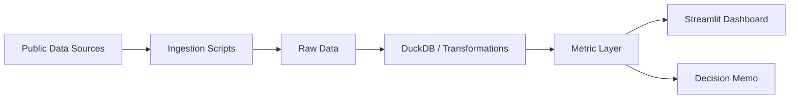

# Implementation Plan

## Strategy

Build in three layers:

1. **Synthetic MVP**: prove the decision flow and scoring design before data ingestion.
2. **Public-data v1**: replace placeholder fields with official public-data-backed metrics.
3. **Portfolio release**: polish narrative, screenshots, memo, tests, and citations.

## Recommended build sequence

1. Run synthetic Streamlit MVP.
2. Add scoring tests.
3. Add source inventory.
4. Integrate one public demographic layer.
5. Integrate one accessibility or POI layer.
6. Add data-quality and confidence scoring.
7. Add scenario sensitivity.
8. Write decision memo.
9. Run Codex review.
10. Prepare public release package.

## First public-data integration: candidate comparison

Before writing any ingestion code, the first real source is selected by comparing the
four primary candidates across six axes. Scores are 1 (low) to 5 (high). For
*implementation difficulty* and *geospatial complexity*, **lower is easier**, so they
are shown as a friction cost — a low number is better for a first integration.

| Source | Credibility | Impl. difficulty (lower=easier) | API / key | Geospatial complexity (lower=easier) | Dashboard usefulness | Portfolio value |
|---|---|---|---|---|---|---|
| **e-Stat** | 5 (official gov statistics) | 2 (REST + free appId; table selection is the main friction) | REST API, free appId | 1 (join by municipality code, no GIS pipeline) | 5 (anchors the Demand score) | 4 (clean reproducible API ingestion) |
| **MLIT National Land Numerical Information** | 5 (official ministry) | 4 (bulk shapefiles, CRS handling) | none (file download) | 5 (full vector GIS) | 4 (accessibility + cost) | 5 (shows real geospatial engineering) |
| **Tokyo Open Data Catalog** | 4 (official, but mixed republished data) | 3 (inconsistent schemas per dataset) | CKAN API, no global key | 2–3 (dataset dependent) | 3 (enrichment, not a spine) | 3 (less distinctive) |
| **OSM / Overpass** | 3 (crowdsourced; uneven coverage) | 3 (Overpass QL + rate limits + caching) | no key, rate-limited | 3 (lat/lon points → spatial join) | 5 (commercial / competition density) | 5 (geospatial + API skill, recognizable) |

### Reading the comparison

- **e-Stat** is the lowest-friction credible start: official data, a free API, and —
  critically — **no GIS pipeline required** for a first cut, because municipality-level
  tables join on the standard local-government code. It also anchors the headline
  *Demand* score, so it delivers the most decision value per unit of effort.
- **MLIT** has the highest portfolio value (real geospatial engineering) but also the
  highest setup cost (shapefiles, CRS, large files). Better as the second/third layer
  once the area spine and scoring pipeline already exist.
- **OSM / Overpass** is the natural second layer: it introduces a spatial join and the
  competition proxy, while its uneven coverage gives a genuine, demonstrable reason to
  build the confidence/penalty layer.
- **Tokyo Open Data** is best as enrichment, not the anchor — schemas and cadences are
  inconsistent across datasets.

### First public-data integration recommendation

**Integrate e-Stat first, at municipality (ward) grain, to power the Demand layer.**

Rationale:

1. **Lowest geospatial friction** — joins on the municipality code; no shapefile/CRS
   pipeline needed to ship a first real-data layer.
2. **Maximum credibility for the headline metric** — Demand is the most prominent
   score, so anchoring it in official government statistics raises trust fastest.
3. **Reproducible, reviewable ingestion** — a documented REST API with JSON output
   produces clean, testable ingestion code (strong BI-Engineer signal).
4. **Establishes the area-key spine** — the municipality code becomes the join key that
   every later layer (OSM, MLIT) attaches to, so this step de-risks all the others.

Sequencing after the first integration: OSM/Overpass (commercial/competition, adds the
spatial join) → MLIT stations (accessibility) → MLIT land price (cost). This escalates
geospatial difficulty one controlled step at a time.

Scope guard for the first integration: **ward grain only**, a small fixed set of e-Stat
tables, ingestion cached to local files, and synthetic fields kept clearly labeled
until each real layer replaces them. Finer mesh/H3 grain is a later enhancement.

### Layer build order and status

| Order | Layer | Source | Status |
|---|---|---|---|
| 1 | Demand | e-Stat Population Census (ward population) | **done (v1, live verified)** |
| 2 | Competition / commercial density | OSM `shop=convenience` via Overpass | **done (v1 sample; OSM live pending — Overpass 429/504, retry off-peak)** |
| 3 | Accessibility | MLIT N02 railway stations | **done (v1 sample; live deferred — GIS)** |
| 4 | Cost proxy | MLIT L01 地価公示 land price | **done (v1, live verified — GIS-free)** |

**Live status (June 2026):** Demand + Cost are live-verified (2 live_public coverage layers),
so the Opportunity Score is available as a REAL ranking at **Medium** confidence; Accessibility
and Competition live ingestion is still pending. A live **daytime-activity layer** (e-Stat
昼間人口, 従業地・通学地集計, daytime cell `cat01=180`) is also integrated as a **Demand-axis refinement**
(positive term, default weight 0 → baseline unchanged; not a 5th coverage layer, so confidence
is unaffected). Raising the daytime weight re-ranks central business wards up (Chiyoda 23→17,
Minato 21→11), making the resident-vs-daytime tension explicit and tunable. Exact reproduction
steps and observed results: `docs/live_data_runbook.md`.

Layer 3 ships the GIS-free pipeline (parse + transform + tests + sample). Live N02 →
ward assignment needs a point-in-polygon spatial join (GeoPandas), intentionally
deferred behind the optional `.[geo]` extra rather than added as a core dependency.

Layer 4 (Cost) is **GIS-free even live**: L01 carries the municipality code, so wards
aggregate by code from a downloaded L01 GeoJSON — no spatial join. All four core
opportunity signals (Demand+, Accessibility+, Competition−, Cost−) now have public-data
layers.

**4 public-data layers integrated into the Opportunity Score** (`ingestion/opportunity.py`):
the layers are joined on the ward-code spine into `opportunity_score` with a per-ward
`confidence_label` and `data_uncertainty_penalty`. A REAL ranking requires ≥ 2
live_public layers; otherwise only the clearly-labeled sample/demo integration is shown.
This is public-data screening — not a revenue/demand/profitability estimate. Next:
add Growth, run more layers live, and build the decision memo on top of the score.

Each step is independently shippable and escalates geospatial difficulty by one
controlled increment. The Demand layer (step 1) establishes the municipality-code spine
that steps 2–4 join onto.

## Architecture

## MVP scope

### Must have

- Area ranking table
- Score breakdown
- Scenario weight controls
- Clear caveat that current data is synthetic until ingestion is implemented
- Metric definitions documented
- Tests for scoring logic

### Should have

- Simple map or spatial placeholder
- Confidence label by area
- Data-source status table

### Should not have in MVP

- ML demand forecast
- real revenue claim
- deployment complexity
- excessive chart count

## V1 public-data scope

Minimum real-data-backed version:

- One demographic layer
- One accessibility layer
- One commercial-density or competition proxy
- Confidence/caveat field
- Updated README and screenshot

## Release criteria

Do not publicly share as a polished portfolio until:

- The dashboard runs locally.
- README has setup instructions.
- Data sources and limitations are documented.
- Scores are defined outside the UI code.
- At least one public-data layer is real.
- Synthetic fields are labeled if still present.
- Codex review has been run or manually simulated.
